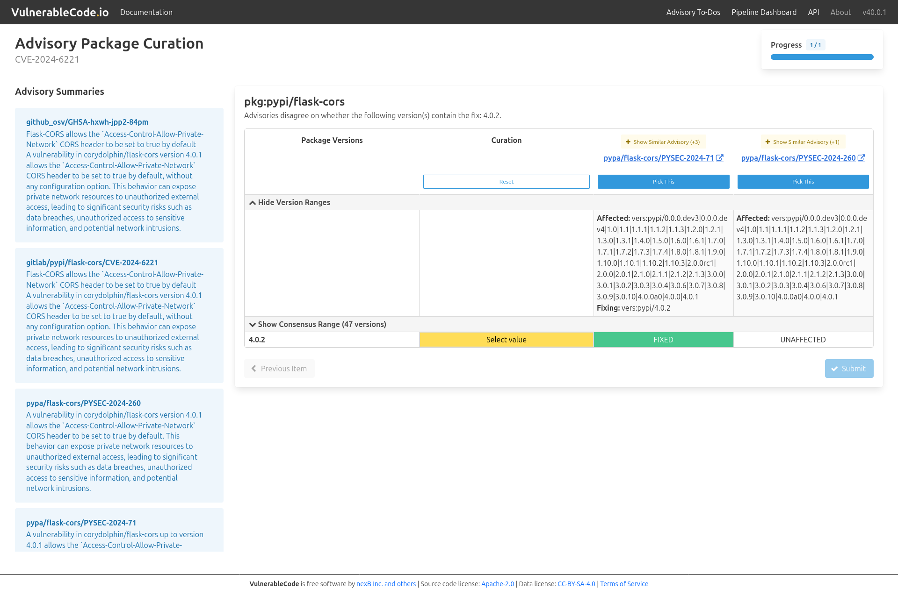

.. _advisory-package-curation:

Advisory Package Curation
=========================

Follow these steps to curate the packages associated with an advisory:

1. Click the alias you want to curate (for example, **CVE-2024-6221**).

2. Select the appropriate package version status.

   - For each package version, click **Select value** and choose one of the following statuses:

     - **AFFECTED**
     - **FIXED**
     - **UNAFFECTED**

   .. image:: images/package_select_value.png

   .. note::

      Click **Select value** multiple times to cycle through the available statuses (**AFFECTED**, **FIXED**, and **UNAFFECTED**).

      Alternatively, if one of the suggested advisories is correct, click **Pick this** to automatically apply the recommended package version information.

   .. image:: images/package_pick_this.png

3. Click **Next item**. If the button is available, repeat steps 2–3 for each remaining package.

   .. image:: images/package_next_item.png

4. After reviewing all packages, click **Submit** to save and complete the package curation.

   .. image:: images/package_submit.png