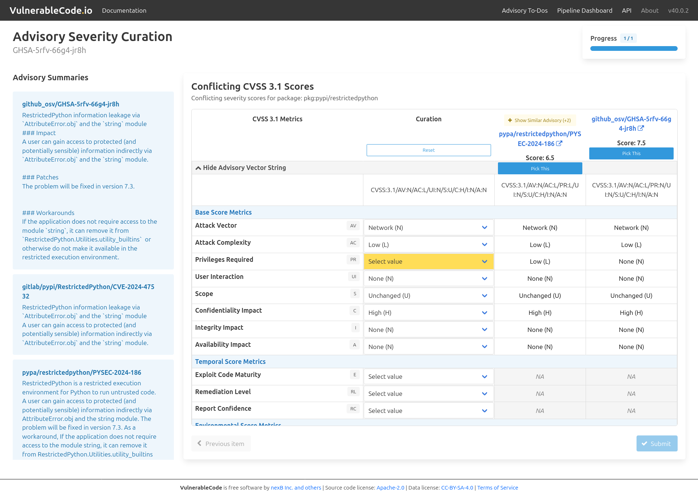

.. _advisory-severity-curation:

Advisory Severity Curation
==========================

Follow these steps to curate the severity for advisories:

1. Click the alias you want to curate (for example, ``GHSA-5rfv-66g4-jr8h``)

2. For each key, select the appropriate vector value from the available options

   .. image:: images/severity_select_value.png

   Alternatively, select the correct advisory severity

   .. image:: images/severity_pick_this.png

3. Click **Next item**, if the button is available, and repeat steps 2–3 for each remaining severity

4. Once you have curated all advisories, click **Submit**

   .. image:: images/severity_submit-button.png