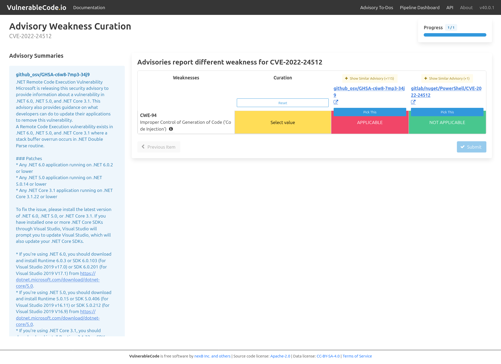

.. _advisory-weakness-curation:

Advisory Weakness Curation
===========================

Follow these steps to curate the `Common Weakness Enumeration (CWE) <https://cwe.mitre.org/>`_ associated with an advisories:

1. Click the Alias you want to curate, for example, ``CVE-2022-24512``.

2. Select the appropriate CWE status (APPLICABLE or NOT APPLICABLE) for the selected CWE ID.

   .. image:: images/weakness_select_value.png

   OR, you can select the CWE status from an advisory that you trust to provide accurate data.

   .. image:: images/weakness_pick_this.png

3. Click **Submit**.

   .. image:: images/weakness_submit.png